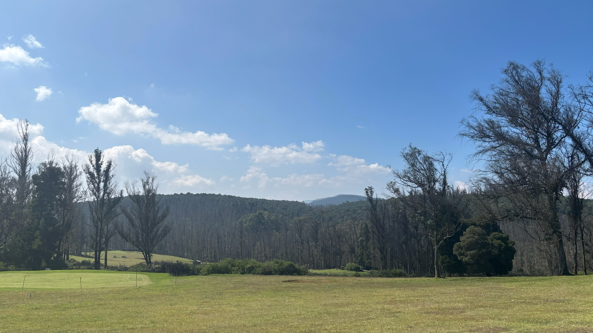

#  Ooty VM: Proving computational integrity of BrainFuck ISA

We have implemented all the cryptography libraries needed for this VM from scratch. Before going through this VM, you must have a strong understanding of the STARK protocol. To help with that, we recommend going through the [stark101](https://starkware.co/stark-101/) by Starkware and reviewing the [stark101](https://starkware.co/stark-101/) implementation in Rust.

We have made some modifications to the [Brainstark](https://aszepieniec.github.io/stark-brainfuck/index), such as using univariate polynomials and applying the FRI protocol on the combination of quotient polynomials. Additionally, we have implemented optimizations to reduce the proving time, such as parallel computing for Lagrange polynomials, among other improvements.

> ⚠️ **Warning:** This code is unaudited and made available only for educational purposes. Not recommended for production use. Check license for usage.

## Structure
- [main.rs](./src/main.rs) - execute, prove and verify hello world brain fuck program.
- [vm](./src/vm/mod.rs) -  tools to compile, run and simulate the brain fuck program.
- [stark](./src/stark/mod.rs) - prover and verifier functions along with helpers.
- [tables](./src/tables/) - Processor, Instruction, IO and Memory Tables. 
- [fri](./src/fri/mod.rs)- Minimal implementation of FRI protocol.
- [field](./src/fields/mod.rs) - Modular operations.
- [polynomial](./src/univariate_polynomial/mod.rs) - Univariate polynomial and modulo polynomial primitives.
- [merkle tree](./src/merkle/mod.rs) - A wrapped implementation of merkle tree.
- [channel](./src/channel/mod.rs) - Simulates prover and verifer interactions as a fiat shamir oracle.

## Resources:

- [Brainstark part 1](https://aszepieniec.github.io/stark-brainfuck/engine)
- [Brainstark part 2](https://aszepieniec.github.io/stark-brainfuck/brainfuck)
- [Brainstark part 3](https://aszepieniec.github.io/stark-brainfuck/arithmetization)
- [Brainfuck ISA](https://en.wikipedia.org/wiki/Brainfuck#:~:text=The%20language%20takes%20its%20name,the%20boundaries%20of%20computer%20programming.)
- [Writing your own VM](https://www.jmeiners.com/lc3-vm/#:registers)
- [How to code fri from scratch](https://blog.lambdaclass.com/how-to-code-fri-from-scratch/)
- [A summary on the fri low degree testing](https://eprint.iacr.org/2022/1216.pdf)

